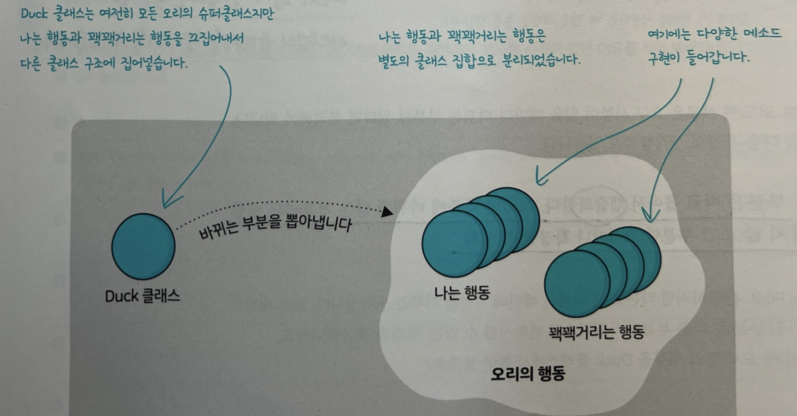
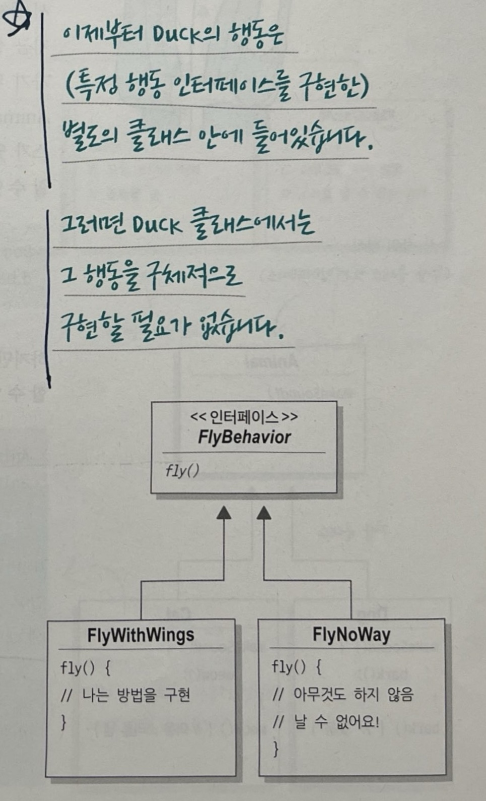
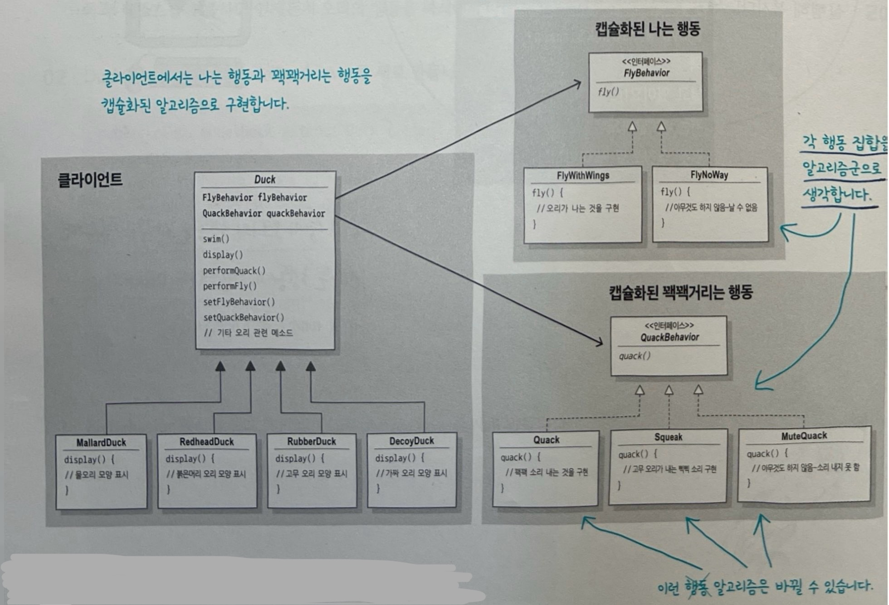

# 01 디자인 패턴 소개와 전략 패턴, 디자인 패턴의 세계로 떠나기

## 디자인 원칙 1
> 애플리케이션에서 달라지는 부분을 찾아내고, 달라지지 않는 부분과 분리한다.  
> 바뀌는 부분은 따로 뽑아서 캡슐화한다. 그러면 나중에 바뀌지 않는 부분에는 영향을 미치지 않고 그 부분만 고치거나 확장할 수 있다.

## 디자인 원칙 2
> 구현보다는 인터페이스에 맞춰서 프로그래밍한다.  
> 특정 구현에 의존하면 코드 간 결합도가 높아져 변경에 취약해지고, 유연성과 재사용성이 떨어진다.   
> 핵심은 실제 실행 시에 쓰이는 객체가 코드에 고정되지 않도록 상위 형식(supertype)에 맞춰 프로그래밍해서 다형성을 활용해야 한다는 점에 있다.

## 디자인 원칙 3
> 상속보다는 구성을 활용한다.  
> 구성을 활용해서 시스템을 만들면 유연성을 크게 향상시킬 수 있다.  
> 알고리즘군을 별도의 클래스 집합으로 캡슐화할 수 있으며 구성 요소로 사용하는 객체에서 올바른 행동 인터페이스를 구현하기만 하면 실행 시에 행동을 바꿀 수도 있다.

## 전략 패턴(Strategy Pattern)
> 변하는 부분인 알고리즘군(각 행동 집합)을 정의하고 이를 캡슐화하여, 각각의 알고리즘군을 수정해서 쓸 수 있게 해 준다. 전략 패턴을 사용하면 클라이언트로부터 알고리즘을 분리해서 독립적으로 변경할 수 있다. 

## 마무리
- 디자인 패턴은 클래스와 객체를 구성해서 반복되는 문제를 효과적으로 해결하는 방법을 제시한다.
- 유연하고, 재사용이 용이하고, 관리하기 쉬운 객체지향 시스템을 설계한느 일은 쉽지 않기 때문에, 검증된 설계 방법들을 정리한 것이 바로 디자인 패턴이다.
- 이러한 패턴들은 모두 객체지향 설계 원칙을 기반으로 한다.
- 관리하기 쉬운 시스템을 만들기 위해서는 앞으로 어떻게 변화할 수 있을지를 미리 생각해 보는 게 필요하다.
