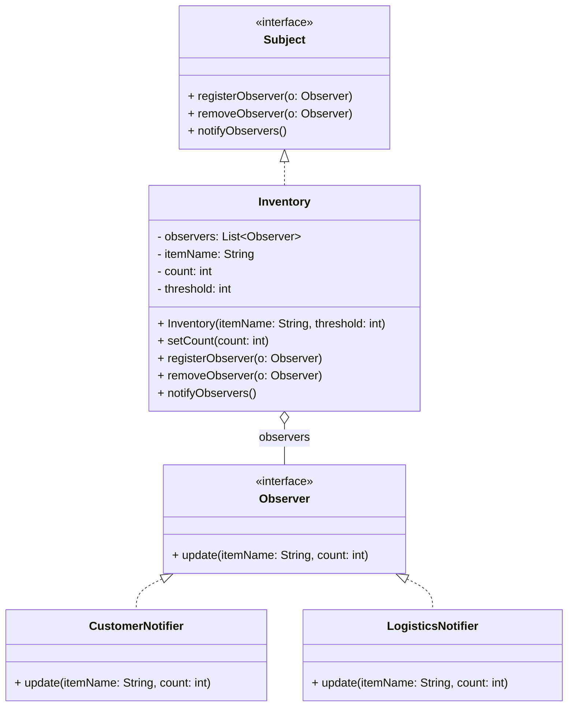

```mermaid
classDiagram
    %% 인터페이스
    class Subject {
        <<interface>>
        + registerObserver(o: Observer)
        + removeObserver(o: Observer)
        + notifyObservers()
    }
    class Observer {
        <<interface>>
        + update(itemName: String, count: int)
    }

    %% 구체 Subject
    class Inventory {
        - observers: List~Observer~
        - itemName: String
        - count: int
        - threshold: int
        + Inventory(itemName: String, threshold: int)
        + setCount(count: int)
        + registerObserver(o: Observer)
        + removeObserver(o: Observer)
        + notifyObservers()
    }

    %% 구체 Observer
    class CustomerNotifier {
        + update(itemName: String, count: int)
    }
    class LogisticsNotifier {
        + update(itemName: String, count: int)
    }

    %% 관계
    Subject <|.. Inventory
    Observer <|.. CustomerNotifier
    Observer <|.. LogisticsNotifier
    Inventory o-- Observer : observers
```