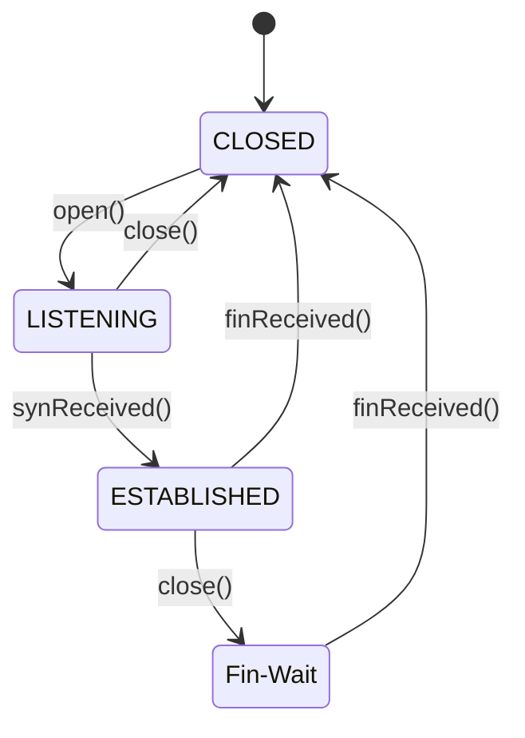

## 상태(State) 패턴
TCP 연결 상태 관리

- 상태: Closed, Listening, Established, Fin-Wait

- 수신 이벤트에 따라 상태 전이

- Closed 상태에서 open() 호출 → Listening

- Established에서 close() 호출 → Fin-Wait 등

```mermaid
    stateDiagram-v2
    direction TB
    [*] --> CLOSED
    CLOSED --> LISTENING: open()
    LISTENING --> ESTABLISHED: synReceived()
    LISTENING --> CLOSED: close()
    ESTABLISHED --> FIN_WAIT: close()
    ESTABLISHED --> CLOSED: finReceived()
    FIN_WAIT --> CLOSED: finReceived()

    state "Fin-Wait" as FIN_WAIT
```