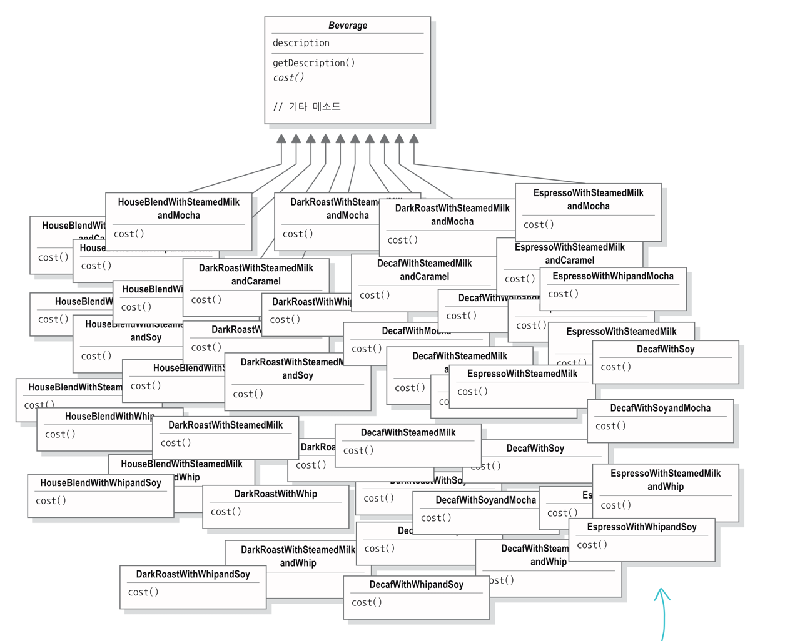

# 데코레이터 패턴

### 기존 커피 서브클래스들
옵션마다 서브클래스를 만들어 관리

시나리오 2: 웹 요청 핸들링 체인
컨텍스트: 웹 애플리케이션에서 요청을 처리하는 기본 핸들러에 로깅, 인증, 캐싱 기능을 필요에 따라 동적으로 조합하여 부가 기능 적용

`/{shopNumber}?userId={userId}&userPw={userPw}`

userId = "userId"
userPw = "userPw"

